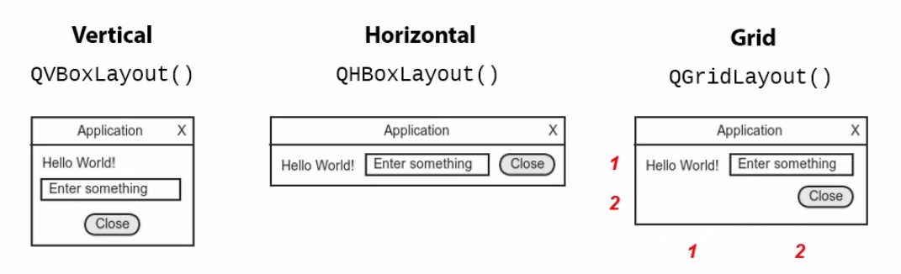

# Writing desktop applications using python and Qt

Qt ("Qute")
- cross-platform
- powerful
- calls native widget toolkits
- Python Qt bindings (PyQt, PySide)

## Tools 
1. [Python 3.7.x](https://www.python.org/downloads/)
2. [PyQt5 -  pip install](https://www.riverbankcomputing.com/software/pyqt/download5)
3. [virtualenv usage](https://www.pythonforbeginners.com/basics/how-to-use-python-virtualenv/)

## PyQt5 Widgets [doc link](https://doc.qt.io/qt-5/qtwidgets-index.html#widgets)

- QApplication
- QDialog
- QLabel
- QLineEdit
- QPushButton
- etc.

## Events - something happens
- event (signals)
- handler (event listener) - capture events
  

## Layouts

- QVBoxLayout
- QHBoxLayout
- QGridLayout

## User input
- QLineEdit => .text() returns a string
- 